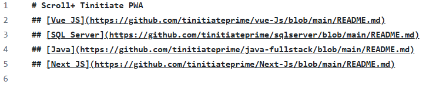
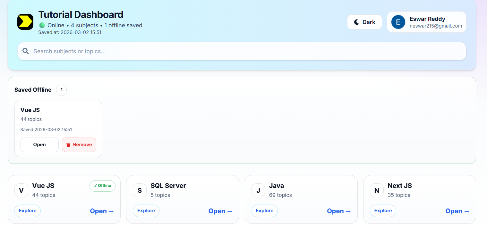
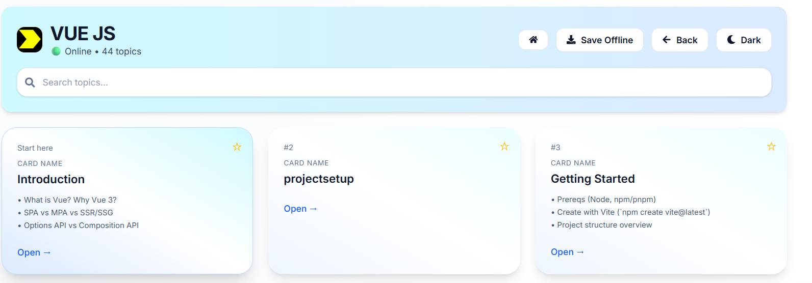
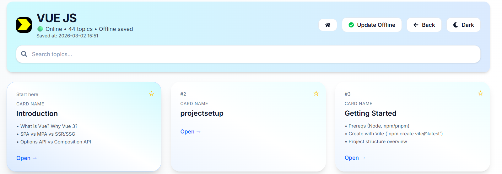
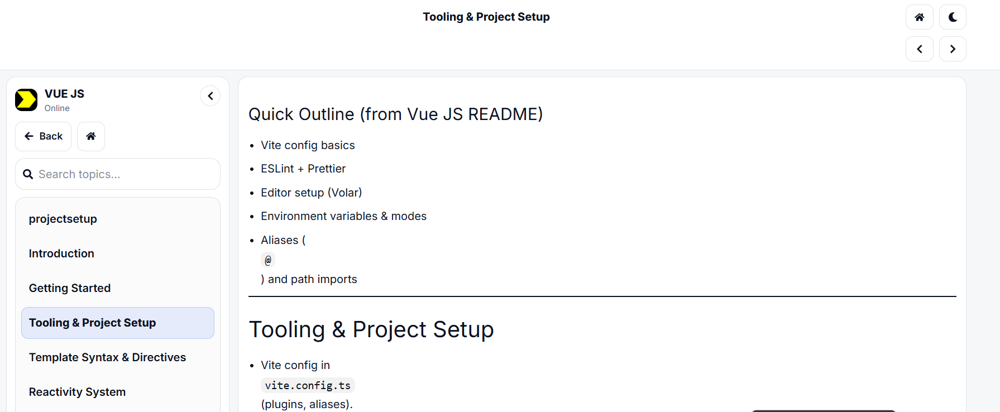
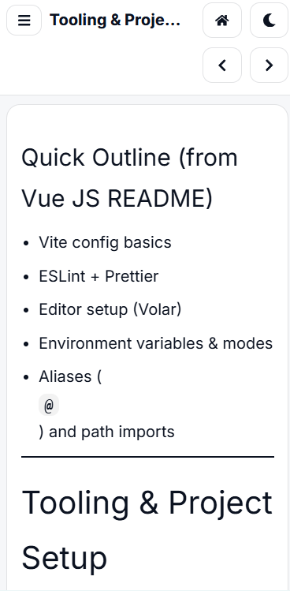
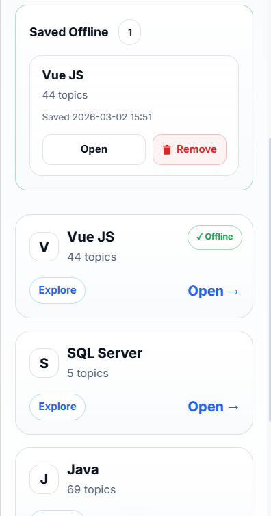
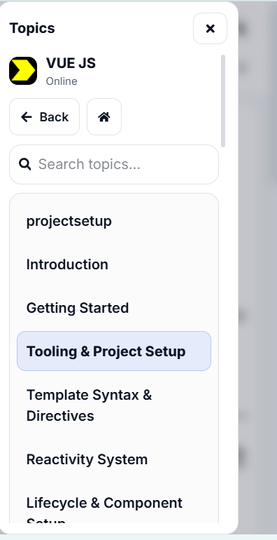
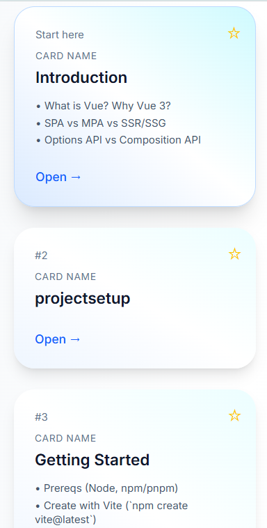

# Tinitiate PWA Documentation

## Overview

- Scroll+ Tinitiate PWA is a Progressive Web App (PWA) that provides subject-wise learning content using Markdown files.

## How the README Structure Works

- Each subject contains a main `README.md` file.

- This README works as the main index for that subject.

- It contains clickable topic links written in Markdown format 

- if you want add another Subject we have to add here main Link here

 

### Example : 

- we have taken one topic which is inside in the README link

⚙️ Reactivity System

**Meaning of Each Part**

- `##`-> Defines a level-2 heading in Markdown

- `[Reactivity System]` -> The visible clickable topic name

- `(./05-reactivity-basics.md)` -> The relative file path to the topic file

**Purpose**  

- This structure ensures that:

- the README remains organized

- topic names are clearly visible

- each topic is clickable

- each topic connects to its own Markdown file

## Why `##` Is Required for Every Topic

- For every topic inside a README, it is compulsory to use ## before the topic name.

**Correct Format**

- => Topic Name

**Why This Is Important**

- It creates a proper heading in Markdown

- It keeps the README structured

- It improves readability

- It maintains consistency across all subjects

- It makes the document easier to scan

- If `##` is not used, the topic may not appear as a proper section heading.

## How Markdown Topic Linking Works

- The linking pattern used in the README is:

`[Topic Name](./file-name.md)`  

Rules

- The topic name must be inside square brackets [ ]

- The file path must be inside parentheses ( )

- The file path should usually be a relative path like ./file-name.md

- The file name must match the actual Markdown file exactly

**Purpose**

- This allows the application and GitHub to correctly connect the topic name to its content file.

## How to Add a New Topic

If a contributor wants to add a new topic, they must follow the same structure.

**Steps**

- Create a `new .md` file in the correct subject folder 

- Add the topic content inside that file

- Open the subject’s main README.md

- Add a new line using the correct Markdown format

**Format**

- New Topic Name

**Checklist**

- `##` must be present

- The topic name must be inside [ ]

- The file path must be inside ( )

- The file name must match exactly

- The file must exist in the correct folder

**Purpose**

- This ensures that the new topic becomes visible and accessible in the subject’s topic list.

- Everything that was explained above is shown in this  screenshot

 

## 1. Signup Flow

When a new user opens the application for the first time, they must create an account using the Signup page.

**Steps**

- The user opens the application.

- The user navigates to the Signup page.

- The user enters the required registration details.

- The application stores the user details in the configured database.

- After successful signup, the user is automatically redirected to the Dashboard.

**Purpose**

- The signup flow allows a new user to create an account and access the learning platform.

## Login Flow

If the user already has an account, they can use the Login page.

**Steps**

- The user opens the application.

- The user navigates to the Login page.
 
- The user enters valid credentials.

- The application verifies the credentials.

- If authentication is successful, the user is redirected to the Dashboard.

- If authentication fails, the user remains on the login page and sees an error message.

**Purpose**

- The login flow allows existing users to securely access the application.

## Dashboard Flow 

After successful signup or login, the user is redirected to the Dashboard.

**Steps**

- The user reaches the dashboard after authentication.

- The dashboard displays the available subjects.

- The user can select any subject from the list. 

**Purpose**

- The dashboard acts as the main entry point after authentication and allows users to navigate to subject content.

- Everything that was explained above is shown in this screenshot
 

## Subject Navigation Flow

When the user selects a subject from the dashboard, the application opens the corresponding Subject Page.

**Steps**

- The user clicks a subject on the dashboard.

- The application opens the subject page.

- The subject page loads the subject’s main README.md.

- The README displays the list of available topics for that subject.

**Save Offline**

- This subject also has a Save Offline option.
- If you want to save it for offline access, click the Save Offline  button on the subject page.

- Once saved, the saved cards will be visible on the Dashboard.”

**Purpose**

- The subject page acts as the bridge between the dashboard and the individual topic content.

- Everything that was explained above is shown in this screenshot

**After Save offline**

## Topic Navigation Flow

Inside the subject page, the user can choose a topic.

**Steps**

- The user sees the list of topics from the subject README.

- The user clicks a topic.

- The application loads the linked Markdown (.md) file for that topic.

- The topic content is rendered and displayed on the screen.

**Purpose**

- This flow allows users to read the selected learning material topic by topic.

## Complete Application Flow

The full user journey in the application is:

- Open the application

- Signup (for new users) or Login (for existing users)

- Redirect to Dashboard

- Select a Subject

- Load Subject README

- Select a Topic

- Load Topic Markdown File

- Display Topic Content

**Flow Summary**

- Signup / Login -> Dashboard -> Subject -> Topic -> Markdown Content

**Mobile view**

- The following screenshots show the mobile view of the application, including the Subject page, Topic page, and Sidebar layout

**Mobile view Topic page view**

**Mobile View Dashboard View**

**Mobile View sidebar**

**Mobile view Subject page**

